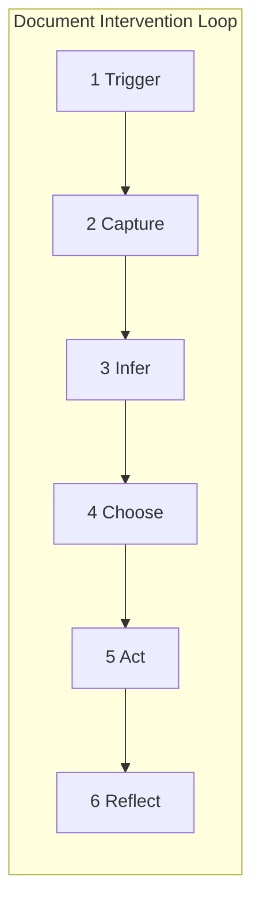
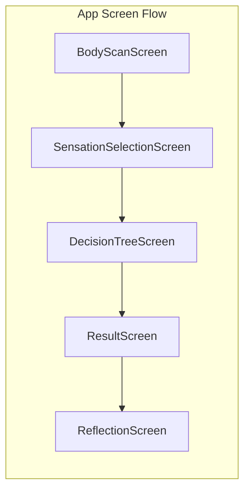

# Research-to-App Alignment Analysis

**Document Version:** 1.0  
**Date:** January 24, 2026  
**Research Document:** [The Architecture of Affect: Bridging Alexithymia, Interoception, and Digital Therapeutics (2026 Edition)](../The%20Architecture%20of%20Affect_%20Bridging%20Alexithymia%2C%20Interoception%2C%20and%20Digital%20Therapeutics%20(2026%20Edition).md)  
**App Name:** SOMA (Somatic Translator)

---

## 1. Executive Summary

The SOMA Flutter app implements the **core intervention loop** and **bottom-up somatic architecture** specified in the research document with strong fidelity. The fundamental philosophy—starting with body sensations rather than emotion labels—is correctly implemented across the user flow.

### Alignment Status

| Category | Status | Coverage |
|----------|--------|----------|
| Core Philosophy (Bottom-Up) | **Aligned** | 100% |
| Intervention Loop | **Mostly Aligned** | ~80% |
| Data Model | **Aligned** | 95% |
| Privacy Architecture | **Aligned** | 90% |
| Wearable/Passive Sensing | **Not Implemented** | 0% (by design) |
| Gamification/Training | **Not Implemented** | 0% |
| Validation Metrics | **Not Implemented** | 0% |

### Key Findings

1. **Strengths:** Body scan interface, sensation vocabulary with neurodivergent metaphors, decision tree translator, encrypted local storage, and reflection loop are all implemented as specified.

2. **Gaps:** Confidence scoring, hypothesis rejection ("none of these"), action completion tracking, pattern analysis, and interoceptive training quests are not yet implemented.

3. **Intentional Omissions:** Wearable integration and push notifications are explicitly out of scope per `REQUIREMENTS.md`.

---

## 2. Concept-to-Code Mapping

### 2.1 Research Section → Implementation

| Research Section | Concept | Implemented File(s) | Status |
|------------------|---------|---------------------|--------|
| **1.1** Working Definitions | Alexithymia, alexisomia, interoception dimensions | `onboarding_screen.dart` (partial) | Partial |
| **1.2** Design Translation | Mapping aid philosophy | App-wide architecture | Aligned |
| **5.0** Intervention Loop | 6-step closed loop | Multiple screens | Mostly Aligned |
| **5.1** Bottom-Up Interface | Body-first question | `body_scan_screen.dart` | Aligned |
| **5.1.1** Homunculus Interface | Body scanner with regions | `HomunculusPainter` class | Aligned |
| **5.1.1** Neurodivergent Metaphors | "Static", "Bees", "Buzzing" | `sensation_vocabulary.json` | Aligned |
| **5.1.2** Decision Tree Logic | Dichotomous key approach | `decision_tree_screen.dart` | Aligned |
| **5.2** Passive Sensing | Wearable integration | — | Not Implemented |
| **5.2.1** Device Reality Matrix | Signal availability table | — | Not Implemented |
| **5.2.2** Nudge Design | Safe defaults, consent-first | — | Not Implemented |
| **5.3** Local-First Privacy | Encrypted local storage | `encrypted_database_helper.dart` | Aligned |
| **5.3.1** Threat Model | Security scenarios | — | Not Documented |
| **5.3.2** Concrete Controls | Encryption, app lock, export safety | Partial | Partial |
| **5.3.3** Legal Framing | HIPAA/HIPRA clarification | — | Not Documented |
| **5.4** Gamification | Interoceptive quests | — | Not Implemented |
| **6.1** Personas | User archetypes | — | Not Used |
| **6.2** Core User Journeys | Baseline, dysregulation, therapy review | App flow | Aligned |
| **6.3** MVP Feature Set | Body scan, decision tree, micro-actions, reflection, history, export | Multiple files | Mostly Aligned |
| **6.4** Data Model | CheckIn, Reflection, Inference, PersonalMapping | `models.dart` | Aligned |
| **6.5** Validation Roadmap | Outcome measures, co-design | — | Not Implemented |

### 2.2 Data Model Alignment

| Document Model | Code Implementation | Match |
|----------------|---------------------|-------|
| `State capture` (timestamp, regions, sensations, intensity, energy, valence) | `CheckIn` class | Yes |
| `Context` (internal/external, social/sensory/task, free-text) | `ContextCategory` enum + `freeText` field | Yes |
| `Inference` (hypotheses, confidence, user selection) | `Inference` class | Partial (confidence not computed) |
| `Intervention` (action chosen, completion) | Not tracked | No |
| `Outcome` (reflection, post-state) | `Reflection` class | Yes |

---

## 3. Implemented and Aligned

### 3.1 Bottom-Up Interface (Research §5.1)

**Specification:**
> "The application must invert the standard flow. It must never open with 'How do you feel?' (Top-Down). It must open with 'What does your body notice?' (Bottom-Up)."

**Implementation:**
```dart
// body_scan_screen.dart
Text(
  'Where do you notice something?',
  style: DesignSystem.bodyStyle(color: Colors.grey),
),
```

**Status:** Aligned

---

### 3.2 Homunculus Interface (Research §5.1.1)

**Specification:**
> "Instead of a wheel, the primary interface is a visual, abstract representation of the body."

**Implementation:**
- `HomunculusPainter` custom painter with 8 body regions
- Tap-to-select with visual glow feedback (`DesignSystem.accentGold`)
- Regions: head/face, neck/throat, shoulders/arms, chest/heart, belly/gut, back, hips/groin, legs/feet

**Status:** Aligned

---

### 3.3 Sensation Vocabulary with Neurodivergent Metaphors (Research §5.1.1)

**Specification:**
> "The system must accept non-clinical descriptors. Autistic users frequently describe internal states as 'static,' 'flickering,' or 'angry bees'."

**Implementation:**
```json
// assets/data/sensation_vocabulary.json
{
  "categories": [
    { "name": "Texture", "tokens": ["Static", "Buzzing", "Bees", "Fizzing", "Prickly", "Smooth", "Soft"] },
    { "name": "Temperature", "tokens": ["Hot", "Warm", "Cold", "Frozen", "Burning"] },
    { "name": "Pressure", "tokens": ["Tight", "Squeezed", "Heavy", "Light", "Hollow", "Empty"] },
    { "name": "Movement", "tokens": ["Racing", "Pounding", "Fluttering", "Still", "Sinking"] },
    { "name": "Conceptual", "tokens": ["Loud", "Quiet", "Foggy", "Sharp", "Numb", "Alive"] }
  ]
}
```

**Status:** Aligned

---

### 3.4 Decision Tree Logic (Research §5.1.2)

**Specification:**
> "The app should use a Dichotomous Key or Logic Tree approach... Step 1: High Energy or Low Energy? Step 2: Pleasant or Unpleasant? Step 3: Internal (Body) or External (World)?"

**Implementation:**
- `DecisionTreeScreen` with 5 paginated steps
- Steps: Energy → Valence → Intensity → Source (Inside/Outside) → Context
- `InferenceService.calculateHypotheses()` maps combinations to hypotheses

**Status:** Aligned (enhanced with intensity and context steps)

---

### 3.5 Hypothesis Generation (Research §5.0 step 3)

**Specification:**
> "The app proposes 2–4 plausible state hypotheses (e.g., overstimulation, anxiety, fatigue, hunger/pain)"

**Implementation:**
```dart
// inference_service.dart
if (valence == Valence.unpleasant) {
  if (energy == EnergyLevel.high) {
    if (source == 'Outside') {
      return [Hypothesis(name: 'Overstimulation', ...)];
    } else {
      return [Hypothesis(name: 'Anxiety / Alarm', ...)];
    }
  } else {
    if (source == 'Outside') {
      return [Hypothesis(name: 'Shutdown / Freeze', ...)];
    } else {
      return [Hypothesis(name: 'Fatigue / Sickness', ...)];
    }
  }
}
```

**Status:** Aligned (returns 1 hypothesis per branch; document suggests 2-4)

---

### 3.6 Reflection Loop (Research §5.0 step 6)

**Specification:**
> "A follow-up nudge after a short interval ('Did that help?') to strengthen the user's personal mapping over time."

**Implementation:**
- `ReflectionScreen` with 3 options: "IT HELPED" / "NOT REALLY" / "NOT SURE"
- Saves `Reflection` linked to `CheckIn` via `checkInId`

**Status:** Aligned (immediate reflection; timed follow-up not implemented)

---

### 3.7 Local-First Encrypted Storage (Research §5.3)

**Specification:**
> "All journal entries, biometric data, and somatic maps must be stored locally on the device (SQLite/JSON)."

**Implementation:**
- `EncryptedDatabaseHelper` using `sqflite_sqlcipher`
- AES-256 encryption with key stored in `FlutterSecureStorage`
- Tables: `check_ins`, `reflections`

**Status:** Aligned

---

### 3.8 Therapist Export (Research §5.3)

**Specification:**
> "Data leaves the device only via user-initiated export (PDF/CSV) for a clinician"

**Implementation:**
- `ExportService.exportToPdf()` generates summary report
- Includes date, energy, valence, hypothesis, helpfulness, and session notes
- Shared via platform sharing mechanism

**Status:** Aligned (PDF only; CSV not implemented)

---

## 4. Partial Implementations

### 4.1 Confidence Indicator (Research §5.0 step 3)

**Specification:**
> "...with an explicit uncertainty indicator ('low confidence / medium / high')."

**Implementation:**
- `Confidence` enum exists in `models.dart`
- `InferenceService` does NOT compute or return confidence
- `ResultScreen` does NOT display confidence

**Gap:** Confidence scoring logic and UI needed

---

### 4.2 User Selection/Override (Research §5.0 step 4)

**Specification:**
> "The user confirms/edits (including 'none of these'), optionally adds context"

**Implementation:**
- User sees hypothesis and clicks "I UNDERSTAND"
- No option to reject hypothesis or select from alternatives

**Gap:** Add "This doesn't fit" / "None of these" option with custom input

---

### 4.3 Micro-Actions (Research §5.0 step 5)

**Specification:**
> "Offer 1–3 micro-actions aligned to the chosen state (breathing, sensory reduction, movement, hydration/food reminder, boundary script)."

**Implementation:**
- Actions are displayed in `ResultScreen` via `_ActionCard`
- Actions are NOT tracked as selected or completed

**Gap:** Add action selection and completion tracking

---

### 4.4 Personal Mapping / Learning (Research §6.4)

**Specification:**
> "...so the user learns their own patterns over time."

**Implementation:**
- `PersonalMapping` class exists in `models.dart`
- No code actually populates or uses this data

**Gap:** Implement pattern learning from confirmed reflections

---

### 4.5 History Pattern View (Research §6.3)

**Specification:**
> "Show 'most common sensations → contexts → what helped' (make change visible)."

**Implementation:**
- `HistoryScreen` shows chronological list of check-ins
- No pattern analysis or aggregation

**Gap:** Add pattern summary view

---

### 4.6 Privacy Controls (Research §5.3.2)

**Specification:**
> "App lock: optional passcode/biometric gate on open and on export."

**Implementation:**
- Encryption at rest: Yes
- App lock: No
- Export warning: No

**Gap:** Add optional app lock and export safety warning

---

## 5. Not Yet Implemented

### 5.1 Passive Sensing / Wearables (Research §5.2)

**Specification:** Integration with HR, HRV, motion, sleep, skin temperature, and (optionally) EDA from wearables.

**Status:** Explicitly out of scope per `REQUIREMENTS.md`:
> "Wearable device integration" listed under "Out of Scope"

**Recommendation:** Consider as future phase after core validation.

---

### 5.2 Nudge Design (Research §5.2.2)

**Specification:** Conservative, consent-first prompts triggered by physiological changes.

**Status:** Not implemented; app is entirely user-initiated.

**Recommendation:** Depends on wearable integration.

---

### 5.3 Gamification / Interoceptive Training (Research §5.4)

**Specification:**
> "Gamified 'Quests' based on Kelly Mahler's Interoception Curriculum. Quest Example: 'The Ice Challenge.'"

**Status:** Not implemented.

**Recommendation:** Add as engagement feature after core loop is validated.

---

### 5.4 Threat Model Documentation (Research §5.3.1)

**Specification:** Documented threat scenarios (lost device, coercive access, backup leakage, SDK exfiltration, export mishandling).

**Status:** Not documented; encryption exists but no formal threat model.

**Recommendation:** Create `docs/SECURITY.md` with threat model.

---

### 5.5 Validation Roadmap (Research §6.5)

**Specification:** Co-design sessions, usability pilots, effect pilots with pre/post measures (alexithymia, interoceptive awareness, emotion regulation).

**Status:** Not implemented or documented.

**Recommendation:** Add `docs/VALIDATION_PLAN.md` and integrate outcome measures.

---

## 6. Architecture Comparison

### 6.1 Document Intervention Loop vs. App Flow





### 6.2 Mapping

| Loop Step | Document Description | App Screen | Alignment |
|-----------|---------------------|------------|-----------|
| 1. Trigger | User-initiated or passive prompt | App launch / manual start | Partial (no passive) |
| 2. Capture | Body scan + sensations + energy/valence | `BodyScanScreen` → `SensationSelectionScreen` → `DecisionTreeScreen` | Aligned |
| 3. Infer | Decision tree → hypotheses + confidence | `InferenceService` → `ResultScreen` | Partial (no confidence) |
| 4. Choose | User confirms/rejects | `ResultScreen` "I UNDERSTAND" | Partial (no reject) |
| 5. Act | Select and complete micro-action | `ResultScreen` action cards | Partial (display only) |
| 6. Reflect | Did it help? + post-state | `ReflectionScreen` | Aligned |

---

## 7. Recommendations

### 7.1 High Priority (Core Loop Completion)

| Item | Effort | Impact | Recommendation |
|------|--------|--------|----------------|
| Add confidence scoring | Medium | High | Compute confidence in `InferenceService` based on signal clarity; display in `ResultScreen` |
| Add "None of these" option | Low | High | Add button in `ResultScreen` to reject hypothesis and enter custom note |
| Track action completion | Medium | Medium | Add selection state to actions; save which action was tried |

### 7.2 Medium Priority (User Value)

| Item | Effort | Impact | Recommendation |
|------|--------|--------|----------------|
| Pattern analysis in History | Medium | High | Aggregate common sensation→context→outcome patterns; show in `HistoryScreen` |
| Implement `PersonalMapping` | High | High | Learn from confirmed reflections; personalize hypotheses over time |
| Add CSV export | Low | Medium | Extend `ExportService` with CSV format |

### 7.3 Lower Priority (Future Phases)

| Item | Effort | Impact | Recommendation |
|------|--------|--------|----------------|
| Document threat model | Low | Medium | Create `docs/SECURITY.md` |
| Add app lock option | Medium | Medium | Optional passcode/biometric on app open |
| Gamification / Quests | High | Medium | Add interoceptive training activities |
| Wearable integration | Very High | High | Future phase; requires platform-specific work |
| Validation measures | Medium | High | Integrate TAS-20, MAIA, or similar instruments |

---

## 8. Appendix: Key File References

### 8.1 Research Document

| Section | Topic |
|---------|-------|
| 1.1 | Working Definitions (alexithymia, alexisomia, interoception) |
| 1.2 | Design Translation (mapping aid philosophy) |
| 5.0 | Intervention Loop (6-step closed loop) |
| 5.1 | Bottom-Up Interface |
| 5.2 | Passive Sensing & Digital Biomarkers |
| 5.3 | Privacy: Local-First Mandate |
| 5.4 | Gamification: Interoceptive Training |
| 6.1–6.5 | Productization (MVP scope, personas, validation) |

### 8.2 App Code Files

| File | Purpose |
|------|---------|
| `lib/presentation/body_scan_screen.dart` | Homunculus body scanner UI |
| `lib/presentation/sensation_selection_screen.dart` | Sensation token selection |
| `lib/presentation/decision_tree_screen.dart` | Energy/valence/source/context flow |
| `lib/presentation/result_screen.dart` | Hypothesis display and actions |
| `lib/presentation/reflection_screen.dart` | "Did that help?" feedback |
| `lib/presentation/history_screen.dart` | Check-in history view |
| `lib/domain/inference_service.dart` | Hypothesis generation logic |
| `lib/domain/export_service.dart` | PDF export |
| `lib/data/models.dart` | Data models (CheckIn, Reflection, etc.) |
| `lib/data/encrypted_database_helper.dart` | SQLCipher encrypted storage |
| `assets/data/sensation_vocabulary.json` | Sensation token vocabulary |
| `docs/REQUIREMENTS.md` | Functional/non-functional requirements |

---

## 9. Conclusion

The SOMA app demonstrates strong alignment with the research document's core philosophy and intervention loop. The bottom-up, body-first approach is correctly implemented, and the local-first privacy architecture meets the specified requirements.

The primary gaps are:
1. **Confidence scoring** for hypothesis uncertainty
2. **Hypothesis rejection** ("none of these" option)
3. **Action completion tracking**
4. **Pattern analysis** in history view
5. **Formal threat model** documentation

These gaps represent incremental enhancements rather than architectural changes, and can be addressed in subsequent development cycles without major refactoring.

---

*Document generated: January 24, 2026*
