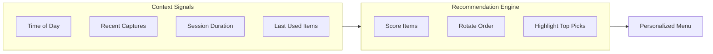

# Context-Aware Regulation Menu + Chat Voice Input

## Part 1: Context-Aware Regulation Menu

### Current State

- Static hardcoded items in [DopamineMenu.tsx](src/components/DopamineMenu.tsx)
- Same items shown every time, in same order
- No awareness of time, user state, or recent activity

### Target State



### Context Factors

| Factor | Logic |

|--------|-------|

| Time of day | Morning: Warm Up emphasis; Afternoon: Deep Work; Evening: Rest |

| Recent captures | Many tasks captured -> suggest Deep Work; Many people -> suggest Support |

| Session duration | Been active 2+ hours -> suggest Rest; Just started -> suggest Warm Up |

| Recently used | Don't show same item twice in a row; shuffle within categories |

### Implementation

1. **Create context hook** - `useRegulationContext()`

   - Get current hour for time-based suggestions
   - Track recently used items in localStorage
   - Optionally fetch recent capture stats

2. **Add scoring function** - Score each item based on context

   - Higher score = more relevant right now
   - Use scores to reorder and highlight

3. **Add "Recommended for you" section** - Top 2-3 picks based on context

4. **Auto-refresh** - Recalculate every 30 minutes or on focus

---

## Part 2: Voice Input for Chat

### Current State

- Text input only in [ChatSidebar.tsx](src/components/ChatSidebar.tsx)
- No microphone button
- useWhisper hook exists but not used here

### Implementation

1. **Add mic button** next to send button
2. **Import useWhisper** hook
3. **Recording states**:

   - Idle: Show mic icon
   - Recording: Show animated indicator + stop button
   - Processing: Show loading state

4. **On transcript ready**: Insert into input field (or auto-send)

### UI Change

```
Current:  [___input field___] [Send]
New:      [___input field___] [Mic] [Send]

Recording: [___"Listening..."___] [Stop] [disabled]
```

---

## Files to Modify

| File | Changes |

|------|---------|

| `src/components/DopamineMenu.tsx` | Add context awareness, scoring, recommendations |

| `src/components/ChatSidebar.tsx` | Add useWhisper, mic button, recording UI |

| `src/lib/hooks/useRegulationContext.ts` | New hook for context signals (optional) |