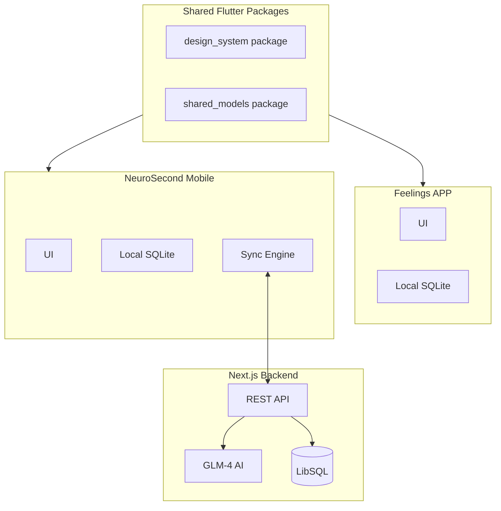

# NeuroSecond Flutter Mobile App

> **Status**: Planning  
> **Created**: January 2026  
> **Goal**: Convert NeuroSecond from a PWA-only app to a Flutter mobile app with local-first architecture, keeping the Next.js backend for AI features and maintaining compatibility with the Feelings APP design system.

---

## Table of Contents

- [Architecture Overview](#architecture-overview)
- [Why Flutter?](#why-flutter)
- [Phase 1: Project Setup](#phase-1-project-setup-and-shared-packages)
- [Phase 2: Data Layer](#phase-2-data-layer)
- [Phase 3: Core Features](#phase-3-core-features)
- [Phase 4: Voice Capture](#phase-4-voice-capture)
- [Phase 5: Compatibility Features](#phase-5-compatibility-features)
- [File Structure](#file-structure-summary)
- [Dependencies](#key-dependencies)
- [Migration Path](#migration-path)
- [Backend Changes](#api-changes-needed-nextjs-backend)
- [Task Checklist](#task-checklist)

---

## Architecture Overview



### Key Architectural Decisions

| Decision | Choice | Rationale |
|----------|--------|-----------|
| AI Processing | Server-side (GLM-4) | Requires internet, but faster and more capable |
| Data Strategy | Local-first with sync | Works offline, syncs when connected |
| State Management | Riverpod | Matches Feelings APP for consistency |
| Database | SQLite (sqflite) | Proven, offline-first, matches Feelings APP |

---

## Why Flutter?

**Pros for this project:**
1. **Compatibility with Feelings APP** - Can create shared packages for design system, models, utilities
2. **Local-first architecture** - Flutter has excellent SQLite support for offline-first apps
3. **Cross-platform** - Single codebase for iOS and Android
4. **Native performance** - Important for a daily-use productivity app
5. **Rich UI capabilities** - Can recreate the vibrant design system

**Tradeoffs:**
- Two frontend codebases: Next.js (web) + Flutter (mobile)
- No code sharing between them (TypeScript vs Dart)
- API contracts must be kept in sync

---

## Phase 1: Project Setup and Shared Packages

### 1.1 Create Flutter project structure

Location: `mobile/`

```
mobile/
├── lib/
│   ├── core/           # Design system, constants
│   ├── data/           # Local DB, API client, sync
│   ├── domain/         # Business logic, services
│   └── presentation/   # Screens, widgets
├── packages/
│   └── design_system/  # Shared with Feelings APP
```

### 1.2 Extract shared design system

Create a shared package that both apps can use:

- Color tokens (map CSS variables to Flutter)
- Typography (Outfit font family)
- Spacing, radius, shadows
- Common widgets (buttons, cards, inputs)

Key mappings from `src/app/globals.css`:

| Token | NeuroSecond (Teal) | Feelings APP (Gold) |
|-------|-------------------|---------------------|
| Primary | `#06B6D4` | `#D4A853` |
| Background Dark | `#1a1a1a` | `#0A0A0A` |
| Theme | Dark-first | Dark-first |

---

## Phase 2: Data Layer

### 2.1 Local SQLite schema

Mirror the Drizzle schema from `src/lib/db/schema.ts`:

```dart
// Tables to create in Flutter
- projects (id, name, status, nextAction, notes, energyLevel, dates, tags)
- people (id, name, context, followUps, dueDate, tags)
- ideas (id, name, oneLiner, notes, dueDate, tags)
- admin_tasks (id, name, dueDate, status, notes)
- inbox_log (id, originalText, filedTo, confidence, status, captureSource)
- sync_queue (id, table, operation, data, synced_at)  // NEW for sync
```

### 2.2 API client

Create typed API client for existing Next.js endpoints:

| Endpoint | Method | Purpose |
|----------|--------|---------|
| `/api/capture` | POST | Quick capture |
| `/api/items/*` | GET/POST/PATCH/DELETE | CRUD operations |
| `/api/chat` | POST | AI assistant |
| `/api/sync` | GET | Fetch changes since timestamp |
| `/api/sync/batch` | POST | Bulk sync operations |

### 2.3 Sync engine

Local-first sync strategy:

1. All writes go to local SQLite first
2. Changes queued in `sync_queue` table
3. Background sync when online
4. Server returns canonical IDs after sync
5. Conflict resolution: last-write-wins with timestamps

```dart
// Sync flow
User Action → Local SQLite → Sync Queue → (when online) → API → Server DB
                                      ↓
                              Update local with server response
```

---

## Phase 3: Core Features

### 3.1 Quick Capture (Priority: High)

- Text input with voice option
- Local save immediately
- Background AI classification via API
- Maps to `src/components/QuickCapture.tsx`

### 3.2 Inbox Review (Priority: High)

- List items needing review
- Swipe actions for filing
- Confidence indicators
- Maps to inbox page

### 3.3 Category Views (Priority: Medium)

- Projects list with status filters
- People with follow-up dates
- Ideas collection
- Admin tasks with completion

### 3.4 AI Chat (Priority: Medium)

- Chat interface for AI assistant
- Message history
- Context-aware responses
- Maps to `src/components/ChatSidebar.tsx`

---

## Phase 4: Voice Capture

### 4.1 Speech-to-text options

Replace browser Whisper.js with Flutter alternatives:

- `speech_to_text` package (uses native APIs)
- Or: Record audio, send to server for Whisper processing

### 4.2 Voice capture flow

1. Tap microphone button
2. Record/transcribe locally
3. Text appears in capture field
4. User confirms and saves

---

## Phase 5: Compatibility Features

### 5.1 Shared design tokens

Extract to shared package usable by both apps:

```dart
// packages/design_system/lib/colors.dart
class NeuroColors {
  static const primary = Color(0xFF06B6D4);     // Teal
  static const projects = Color(0xFFA78BFA);    // Purple
  static const people = Color(0xFFF472B6);      // Pink
  static const ideas = Color(0xFFA3E635);       // Lime
  static const tasks = Color(0xFFFB7185);       // Rose
}

class SomaColors {
  static const gold = Color(0xFFD4A853);        // From Feelings APP
  // ... existing colors
}
```

### 5.2 Future integration points

Potential data sharing between apps:

- Link emotional check-ins to projects/tasks
- "How am I feeling about this project?"
- Energy levels correlation

---

## File Structure Summary

```
/second brain project/
├── src/                    # Keep: Next.js web app + API
├── mobile/                 # NEW: Flutter mobile app
│   ├── lib/
│   │   ├── core/
│   │   │   ├── design_system.dart
│   │   │   ├── constants.dart
│   │   │   └── theme.dart
│   │   ├── data/
│   │   │   ├── database/
│   │   │   │   ├── database_helper.dart
│   │   │   │   └── schema.dart
│   │   │   ├── api/
│   │   │   │   ├── api_client.dart
│   │   │   │   └── endpoints.dart
│   │   │   └── sync/
│   │   │       └── sync_service.dart
│   │   ├── domain/
│   │   │   ├── models/
│   │   │   └── services/
│   │   └── presentation/
│   │       ├── screens/
│   │       ├── widgets/
│   │       └── providers.dart
│   ├── pubspec.yaml
│   └── test/
└── packages/               # NEW: Shared packages
    └── design_system/
```

---

## Key Dependencies

```yaml
# mobile/pubspec.yaml
dependencies:
  flutter_riverpod: ^2.5.0    # State management (matches Feelings APP)
  sqflite: ^2.3.0             # Local SQLite
  dio: ^5.4.0                 # HTTP client
  speech_to_text: ^6.6.0      # Voice capture
  google_fonts: ^6.2.0        # Outfit font
  shared_preferences: ^2.2.0  # Settings
  connectivity_plus: ^6.0.0   # Network status for sync
  uuid: ^4.3.0                # ID generation
  intl: ^0.19.0               # Date formatting
```

---

## Migration Path

| Phase | Duration | Tasks |
|-------|----------|-------|
| 1 | Week 1-2 | Project setup, design system extraction, database schema |
| 2 | Week 3-4 | API client, sync engine, core CRUD operations |
| 3 | Week 5-6 | Quick Capture, Inbox Review screens |
| 4 | Week 7-8 | Category views, voice capture |
| 5 | Week 9-10 | AI Chat, polish, testing |

---

## API Changes Needed (Next.js Backend)

Minor additions to support mobile sync:

- [ ] Add `updated_at` timestamps to all tables for sync
- [ ] Add `GET /api/sync?since=timestamp` endpoint
- [ ] Add `POST /api/sync/batch` for bulk operations
- [ ] Return sync metadata in responses

---

## Task Checklist

### Setup
- [ ] Create Flutter project structure in `mobile/` directory

### Design System
- [ ] Extract shared design system package with color tokens and typography

### Data Layer
- [ ] Implement local SQLite schema mirroring Drizzle models
- [ ] Create typed API client for Next.js endpoints
- [ ] Build local-first sync engine with conflict resolution

### Features
- [ ] Implement Quick Capture screen with text and voice input
- [ ] Build Inbox Review screen with swipe actions
- [ ] Create Projects, People, Ideas, Tasks list views
- [ ] Integrate speech-to-text for voice capture
- [ ] Implement AI Chat interface

### Backend
- [ ] Add sync endpoints to Next.js backend
